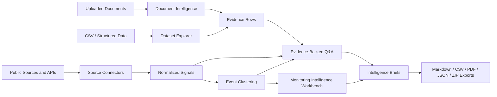

# Africa Energy & Commodities Intelligence Workbench


**Python | Streamlit | Public Data | Intelligence Workbench | Africa |
Energy + Commodities | Document Intelligence | Monitoring Signals | Event
Clustering**

Repository target:
<https://github.com/Drey332/Energy-Commodities-Intelligence-Workbench>

## Summary

Africa Energy & Commodities Intelligence Workbench is a Streamlit-based
public-data intelligence platform for monitoring African energy, commodity,
finance, and risk developments. It combines live/keyless public sources,
optional API-key sources, institutional reports, uploaded documents, structured
datasets, normalized monitoring signals, clustered developments,
evidence-backed Q&A, review queues, and exportable intelligence briefs.

The main result is a working local app that converts scattered public
information into analyst-readable monitoring signals, clusters related
developments, and generates evidence-backed briefs with source transparency. It
runs with keyless public sources and fallback sample data, while optional API
keys can expand live coverage.

## Table Of Contents

- [Why This Project Matters](#why-this-project-matters)
- [Project Snapshot](#project-snapshot)
- [Core Problem](#core-problem)
- [What The Platform Does](#what-the-platform-does)
- [What I Built](#what-i-built)
- [Technology Stack](#technology-stack)
- [Data And Source Connectors](#data-and-source-connectors)
- [Core Files](#core-files)
- [Analyst Workflow](#analyst-workflow)
- [Key Features](#key-features)
- [Example Use Cases](#example-use-cases)
- [Results And Outputs](#results-and-outputs)
- [How To Run](#how-to-run)
- [Environment Variables](#environment-variables)
- [Tests](#tests)
- [Screenshots](#screenshots)
- [Quality, Safety, And Review Design](#quality-safety-and-review-design)
- [Limitations And Next Steps](#limitations-and-next-steps)
- [License And Reuse](#license-and-reuse)
- [About / Topics](#about--topics)

## Why This Project Matters

African energy and commodity systems affect electricity access, fuel prices,
trade, fiscal stability, jobs, infrastructure, climate resilience,
private-sector investment, public finance, and regional risk. But information
about those systems is fragmented across news articles, institutional reports,
PDFs, datasets, and public APIs.

The problem is not only access to information. The harder problem is turning
scattered information into structured knowledge:

- What happened?
- Where did it happen?
- Which country, sector, or commodity is affected?
- What evidence supports the signal?
- Is this a one-off article or part of a larger development?
- What should an analyst watch next?

This workbench demonstrates how data science, NLP/document intelligence, public
APIs, and human-review workflows can support evidence-based monitoring and
knowledge products for development-sector teams.

## Project Snapshot

| Item | Value |
|---|---|
| Task | Public-data monitoring and intelligence synthesis |
| Domain | African energy, commodities, finance, infrastructure, and risk |
| Interface | Streamlit workbench |
| Source types | Live/keyless APIs, optional API-key news sources, uploaded documents, CSV datasets, institutional reports |
| Keyless connectors | GDELT, ReliefWeb, World Bank Indicators, World Bank Documents |
| Optional connectors | NewsAPI, GNews, Guardian, EIA |
| Core outputs | Normalized signals, event clusters, evidence rows, Q&A answers, intelligence briefs, exports |
| Analysis methods | Rule-based classification, signal normalization, deterministic event clustering, dataset profiling, document chunking/search |
| Storage | Local SQLite database plus file-based source registries and exports |
| Quality controls | Source status, evidence lists, retrieval diagnostics, confidence flags, fallback warnings, missing-data flags, review queue |
| Tests | `compileall` plus `unittest` suite |

## Core Problem

Development and policy teams work with large volumes of articles, reports,
datasets, and institutional documents. A static dashboard is not enough. A
useful intelligence system needs to help users inspect evidence, ask questions,
compare signals, cluster related events, and export knowledge products.

This project is built around that operational problem. It treats documents,
datasets, news, source registries, and monitoring events as connected evidence
channels rather than isolated files.

## What The Platform Does

1. Ingests live/public source signals and user-provided documents or datasets.
2. Normalizes raw source items into a common signal schema.
3. Classifies country, sector, commodity, event type, tone, risk flags,
   relevance, and evidence text.
4. Clusters related signals into analyst-readable developments.
5. Lets users inspect documents and datasets directly.
6. Lets users ask questions across documents, data, news, and monitoring
   outputs.
7. Generates evidence-backed intelligence briefs.
8. Exports briefs, signals, clusters, source lists, evidence tables, and review
   packages.

## What I Built



The platform is organized as a local intelligence workbench:

- **Source connectors** collect public or optional-key monitoring signals.
- **Document intelligence** parses uploaded reports into source-traceable chunks.
- **Dataset profiling** turns CSVs into computed summaries, rankings, and chart
  inputs.
- **Signal normalization** maps raw source rows into a shared monitoring schema.
- **Event clustering** groups related signals into developments.
- **Evidence-backed Q&A** answers questions from retrieved and computed evidence.
- **Brief generation** produces analyst-style outputs with source trails.
- **Review queues** keep uncertain, weak, duplicate-like, or high-risk items in a
  human-validation path.

## Technology Stack

| Layer | Tools |
|---|---|
| Application | Python 3.10+, Streamlit |
| Tables and charts | pandas, Plotly |
| Local storage | SQLite |
| Document parsing | pypdf baseline, optional PyMuPDF, optional Docling path in code |
| PDF export | ReportLab |
| Public/API access | Python standard-library `urllib` connectors |
| Retrieval | BM25, local hashing-based dense fallback, optional `sentence-transformers` |
| Testing | Python `unittest`, `compileall` |
| Local configuration | `.env` file loaded by `devfinintel/env.py` |

The core app does not require a cloud database, hosted LLM, or hosted vector
store. Optional local Ollama support can answer follow-up questions from the
bounded evidence pack.

## Data And Source Connectors

The app can run without API keys. Optional keys expand live coverage.

### Keyless / Public Connectors

| Source | Purpose |
|---|---|
| GDELT | Live global news discovery through a public endpoint |
| ReliefWeb | Humanitarian and risk-context public source monitoring |
| World Bank Indicators | Indicator-style public data signals |
| World Bank Documents | Institutional document discovery signals |

### Optional API-Key Connectors

| Source | Environment Variable |
|---|---|
| NewsAPI | `NEWSAPI_API_KEY` |
| GNews | `GNEWS_API_KEY` |
| Guardian | `GUARDIAN_API_KEY` |
| EIA | `EIA_API_KEY` |

If optional keys are missing, connectors return key-safe status messages. The UI
shows whether a key is configured, but never prints the key value.

## Core Files

| Path | Role |
|---|---|
| `app/streamlit_app.py` | Main Streamlit workbench with Overview, Documents, Data, News, Ask & Brief, and Review & Sources tabs |
| `devfinintel/pipeline.py` | End-to-end orchestration for ingestion, retrieval, monitoring, Q&A, brief generation, promotion, and exports |
| `devfinintel/connectors/` | Public and optional-key source adapters |
| `devfinintel/env.py` | `.env` loading and key-safe source status reporting |
| `devfinintel/parsing.py` | PDF, text, Markdown, and CSV parsing |
| `devfinintel/chunking.py` | Page-preserving evidence chunks |
| `devfinintel/datasets.py` | CSV profiling, column analysis, rankings, and chart-ready outputs |
| `devfinintel/signals.py` | Normalized monitoring-signal schema and classification helpers |
| `devfinintel/events.py` | Deterministic event clustering and monitoring-cycle summaries |
| `devfinintel/monitoring.py` | Monitoring sources, normalized events, insight cards, and supervisor logic |
| `devfinintel/workbench.py` | Unified evidence rows, Q&A, and brief-building helpers |
| `devfinintel/indexing.py` | BM25, local dense retrieval fallback, optional sentence-transformers backend, and diagnostics |
| `devfinintel/store.py` | SQLite storage for documents, chunks, sessions, outputs, monitoring runs, review queues, and audit events |
| `devfinintel/exporting.py` | Markdown, CSV, PDF, evidence JSON, manifest JSON, and ZIP export logic |
| `tests/` | `unittest` coverage for the pipeline and monitoring architecture |

## Analyst Workflow

Typical workflow inside the app:

```text
Run Monitoring Cycle
  -> Inspect source status
  -> Review normalized signals
  -> Review event clusters
  -> Promote important signals or clusters
  -> Run Monitoring Supervisor
  -> Ask evidence-backed questions
  -> Generate an intelligence brief
  -> Review quality flags and source trail
  -> Export outputs
```

The workbench is deliberately review-oriented. A live signal is treated as a
monitoring input, not as a verified fact. The analyst can inspect sources,
promote important items, review weak evidence, and export source-backed outputs.

## Key Features

- Unified Streamlit workbench for African energy and commodities monitoring.
- Live/keyless source collection plus optional API-key connectors.
- Source-status panel with missing-key and fallback warnings.
- Normalized signal schema for country, region, sector, commodity, event type,
  tone, risk flags, relevance, and evidence text.
- Deterministic event clustering for related signals.
- Document upload, parsing, search, and evidence-grounded Q&A.
- CSV dataset profiling with computed summaries and visual exploration.
- Monitoring Supervisor that summarizes source health, risks, watchlist items,
  and next actions.
- Human review queue for low-confidence, high-risk, missing-source, weak, or
  duplicate-like items.
- Exportable Markdown, CSV, PDF, JSON evidence, manifest, and ZIP packages.
- Local SQLite audit trail.
- Optional local Ollama follow-up assistant that receives only the bounded
  evidence pack.

## Example Use Cases

### Nigeria Oil And Fuel Monitoring

Track recent signals about fuel prices, refining, oil revenue, regulation,
imports, and inflation risk.

### DRC And Zambia Copper / Cobalt Monitoring

Monitor critical minerals, mining investment, governance issues, project
developments, export risk, and value-chain signals.

### South Africa Power Risk Monitoring

Follow electricity reliability, power-sector reform, grid investment,
infrastructure constraints, and transition-finance signals.

### Africa Energy Access And Indicator Context

Upload CSV indicators or use public data signals to compare countries, inspect
missingness, rank values, and generate chart-ready summaries.

### Weekly Intelligence Brief Generation

Run a monitoring cycle, inspect clusters, ask follow-up questions, and export a
short evidence-backed brief for a development-sector audience.

## Results And Outputs

The repository includes a working local app and sample data. Outputs are created
locally when the user runs the dashboard or CLI.

Generated output types:

- normalized signal tables,
- event cluster tables,
- evidence rows,
- document-grounded Q&A answers,
- dataset profiles,
- monitoring supervisor situation briefs,
- intelligence briefs,
- Markdown reports,
- CSV exports,
- PDF reports,
- evidence JSON,
- manifest JSON,
- ZIP review packages.

Local generated outputs are written to `outputs/`, which is ignored by Git.

## How To Run

Clone the repository:

```bash
git clone https://github.com/Drey332/Energy-Commodities-Intelligence-Workbench.git
cd Energy-Commodities-Intelligence-Workbench
```

Create and activate a virtual environment:

```bash
python3 -m venv .venv
source .venv/bin/activate
pip install -r requirements.txt
```

Optional local upgrades:

```bash
pip install -r requirements-advanced.txt
```

Create a local environment file:

```bash
cp .env.example .env
```

Run the Streamlit app:

```bash
streamlit run app/streamlit_app.py
```

The app stores local state in:

- `storage/workbench.sqlite`
- `outputs/`
- `data/sources/downloads/`

These are ignored by Git.

## Environment Variables

`.env.example`:

```bash
NEWSAPI_API_KEY=
GNEWS_API_KEY=
EIA_API_KEY=
GUARDIAN_API_KEY=

DEVFIN_DEFAULT_REGION=Africa
DEVFIN_NEWS_LOOKBACK_DAYS=7
DEVFIN_MAX_ARTICLES=50
DEVFIN_USE_SAMPLE_DATA=true
```

Notes:

- The app runs without API keys.
- API keys should be stored only in `.env`.
- `.env` is ignored by Git.
- The UI reports whether optional keys are configured, but it does not expose
  secret values.

## Tests

Run the checks:

```bash
python3 -m compileall devfinintel app
python3 -m unittest discover -s tests
```

In restricted local environments where Python cannot write bytecode to the
default cache path, use:

```bash
PYTHONPYCACHEPREFIX=/private/tmp/devfin_pycache python3 -m compileall devfinintel app
PYTHONPYCACHEPREFIX=/private/tmp/devfin_pycache python3 -m unittest discover -s tests
```

The current test suite covers:

- ingestion, generation, and export,
- scoped document generation,
- CSV dataset profiling,
- evidence-pack and manifest behavior,
- source registry and coverage utilities,
- `.env` loading without key exposure,
- keyless connector failure behavior,
- signal normalization,
- event clustering,
- monitoring run persistence,
- promoted signal and cluster persistence,
- review queue behavior.

## Screenshots

Screenshots are not committed yet. Placeholder guidance is in
`docs/screenshots/README.md`.

Recommended screenshots to add:

- Monitoring Intelligence overview,
- source status panel,
- normalized signals table,
- event clusters,
- Monitoring Supervisor situation brief,
- dataset explorer,
- document evidence view,
- review queue and export buttons.

Before committing screenshots, confirm that they do not show API keys, private
documents, personal paths, or confidential data.

## Quality, Safety, And Review Design

This project does not treat automation as final analysis. It adds review and
source transparency at several points:

- source status and missing-key indicators,
- fallback-data warnings,
- evidence rows for answers and briefs,
- retrieval diagnostics,
- confidence flags,
- missing-source and weak-evidence review reasons,
- promoted monitoring items,
- run history,
- local audit tables,
- export manifests.

The goal is to support analyst judgment, not replace it.

## Limitations And Next Steps

Current limitations:

- Public APIs can be delayed, incomplete, rate-limited, or unavailable.
- Optional API coverage depends on local keys.
- Event clustering is deterministic and not expert verification.
- Rule-based country, sector, commodity, tone, and risk classification is
  transparent but imperfect.
- Sentiment/tone is a monitoring and risk signal, not a truth score.
- The retrieval gate and quality metrics are heuristics, not calibrated
  factuality models.
- The app is intended for public and non-confidential data.

Next steps:

- Add stronger entity resolution for countries, companies, donors, projects, and
  institutions.
- Improve deduplication across sources.
- Add richer time-series and map analytics.
- Expand institutional connectors.
- Build an evaluation harness for retrieval, Q&A, briefs, citation precision,
  and numeric faithfulness.
- Add screenshots and a lightweight public demo dataset.
- Add a clear open-source license file.

## License And Reuse

No explicit license file is included yet. Treat the code and sample materials as
portfolio work until a license is added.

Some source registry rows point to public institutional materials. Always check
the original publisher's reuse terms before redistributing source documents.

## About / Topics

Suggested GitHub topics:

```text
python
streamlit
public-data
development-data
document-intelligence
africa
energy
commodities
monitoring
news-analysis
event-clustering
knowledge-management
policy-analysis
sqlite
```
